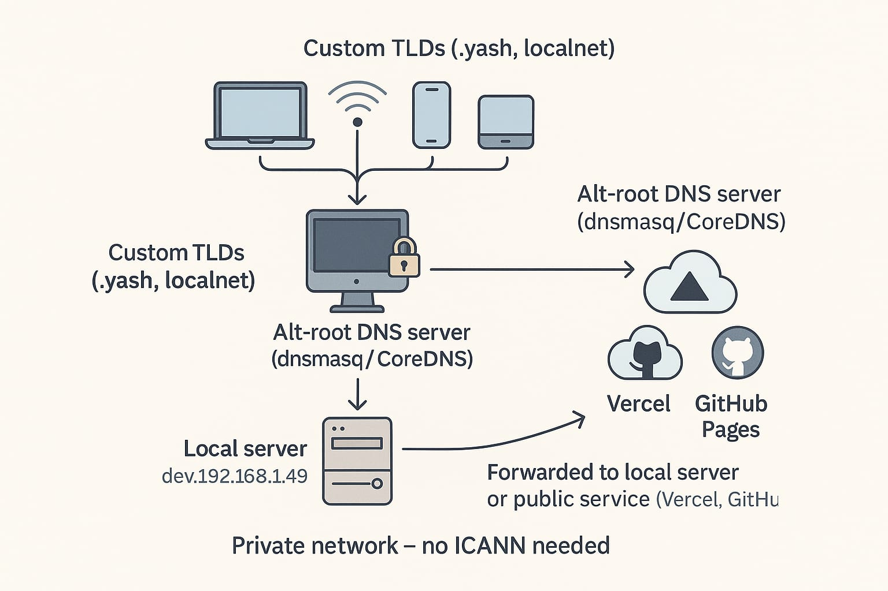

# 🌐 Custom TLD Setup - Build Your Own Internet

[](https://opensource.org/licenses/MIT)
[](https://github.com/username/custom-tld-setup)
[](http://makeapullrequest.com)

## 🚀 Quick Start

> 🔧 **Important**: Replace `192.168.1.100` with your actual server IP address throughout this guide!

### 🔍 Find Your Server IP Address

```bash
# Method 1: Using ip command (Linux)
ip addr show | grep inet

# Method 2: Using hostname command
hostname -I

# Method 3: Using ifconfig (if available)
ifconfig | grep "inet "

# Your output will look like: 192.168.1.X, 10.0.0.X, or 172.16.0.X
```

> 💡 **Note**: Use your **private IP** (192.168.x.x, 10.x.x.x, 172.16-31.x.x) for local network setup, or your **public IP** if setting up external access.

### Method 1: Using dnsmasq (Recommended)

> Create your own custom top-level domains like `.localnet`, `.yash`, or `.mycompany` and serve real content locally or across your private network!

This repository provides a complete guide to setting up your own alt-root DNS infrastructure with custom TLDs. Whether you want `.dev`, `.home`, `.company`, or any custom domain, this guide will help you build your own internet. Alt-Root DNS Setup with `.localnet` TLD

Welcome to the official documentation of how I built my \*\*custom top-level domain like \*\*`.localnet & .yash` and used it to serve real content (even from Vercel and GitHub Pages) using local DNS resolution. This guide walks you through setting up your own alt-root DNS infrastructure and linking it with modern hosting.

---

## 🎯 What You'll Build



With this setup, you can:

- ✅ Create custom TLDs like `.localnet`, `.yash`, `.home`, `.company`
- ✅ Access local services via beautiful domains (`api.localnet`, `dashboard.company`)
- ✅ Route traffic to Vercel, GitHub Pages, or local servers
- ✅ Works across your entire network (mobile, desktop, IoT devices)
- ✅ No internet dependency for local domains
- ✅ Professional development environment

### Example Use Cases

```bash
# Development
http://api.dev        → localhost:3000
http://frontend.dev   → localhost:3001
http://docs.dev       → GitHub Pages

# Company Network
http://intranet.company  → Internal server
http://files.company     → File server
http://chat.company      → Slack alternative

# Home Lab
http://nas.home       → Network storage
http://router.home    → Router admin
http://pi.home        → Raspberry Pi
```

### 🖼️ Live Demo

Here's what a custom `.yash` TLD looks like in action:


*Screenshot showing dev.yash loading successfully in browser*

---

## 📋 Prerequisites

Before you begin, ensure you have:

- 🐧 **Linux machine** (Ubuntu 20.04+, Arch, CentOS, etc.)
- 🌐 **Network access** (for initial setup and external routing)
- 🔧 **sudo privileges** (for system configuration)
- 📱 **Devices to test** (optional: Android/iOS for network-wide testing)

### Optional Requirements
- 🌍 **Public domain** (for external DNS like `dns.yourdomain.com`)
- ☁️ **Vercel/Netlify account** (for mapping to hosted content)
- 🔒 **SSL certificates** (for HTTPS support)

---

##  Quick Start

### Method 1: Using dnsmasq (Recommended)

1. **Install dnsmasq**

   ```bash
   # Ubuntu/Debian
   sudo apt update && sudo apt install dnsmasq
   
   # Arch Linux
   sudo pacman -S dnsmasq
   
   # CentOS/RHEL
   sudo yum install dnsmasq
   ```

2. **Configure dnsmasq**

   Edit `/etc/dnsmasq.conf` (create backup first: `sudo cp /etc/dnsmasq.conf /etc/dnsmasq.conf.backup`):

   ```ini
   # Basic configuration
   domain-needed
   bogus-priv
   no-resolv
   server=8.8.8.8
   server=1.1.1.1

   # Your custom TLD (replace 'localnet' with your preferred TLD)
   local=/localnet/
   address=/api.localnet/YOUR_SERVER_IP
   address=/web.localnet/YOUR_SERVER_IP
   address=/docs.localnet/YOUR_SERVER_IP
   
   # Network configuration (replace with your network interface and IP)
   listen-address=127.0.0.1,YOUR_SERVER_IP
   interface=eth0  # or wlan0, enp0s3, etc.
   
   # Optional: Cache settings
   cache-size=1000
   ```

   > 💡 **Pro Tip**: Find your network interface with `ip addr show` or `ifconfig`
   > 
   > 🔧 **Replace YOUR_SERVER_IP with your actual IP**, for example:
   > - `address=/api.localnet/192.168.1.100` (if your server IP is 192.168.1.100)
   > - `listen-address=127.0.0.1,192.168.1.100`

3. **Start the service**

   ```bash
   sudo systemctl enable dnsmasq
   sudo systemctl start dnsmasq
   sudo systemctl status dnsmasq  # Verify it's running
   ```

   > ⚠️ **Important**: After making config changes, always restart dnsmasq:
   > ```bash
   > sudo systemctl restart dnsmasq
   > ```

4. **Test your setup**

   ```bash
   # Test DNS resolution (replace YOUR_SERVER_IP with your actual server IP)
   nslookup api.localnet 127.0.0.1
   dig @127.0.0.1 web.localnet
   
   # Should return your configured IP (e.g., 192.168.1.100)
   ```

### Method 2: Using CoreDNS (Advanced/Optional)

> ⚠️ **Note**: CoreDNS setup is more complex and recommended for advanced users only. dnsmasq is sufficient for most use cases.

<details>
<summary>Click to expand CoreDNS setup</summary>

1. **Download CoreDNS**
   ```bash
   wget https://github.com/coredns/coredns/releases/latest/download/coredns_linux_amd64.tgz
   tar -xzf coredns_linux_amd64.tgz
   sudo mv coredns /usr/local/bin/
   ```

2. **Create Corefile**
   ```bash
   sudo mkdir -p /etc/coredns
   sudo tee /etc/coredns/Corefile << 'EOF'
   localnet {
       hosts {
           YOUR_SERVER_IP api.localnet
           YOUR_SERVER_IP web.localnet
           fallthrough
       }
   }
   
   . {
       forward . 8.8.8.8 1.1.1.1
   }
   EOF
   ```

   > 🔧 **Replace YOUR_SERVER_IP** with your actual server IP (e.g., 192.168.1.100)

3. **Create systemd service**
   ```bash
   sudo tee /etc/systemd/system/coredns.service << 'EOF'
   [Unit]
   Description=CoreDNS
   After=network.target
   
   [Service]
   ExecStart=/usr/local/bin/coredns -conf /etc/coredns/Corefile
   Restart=always
   
   [Install]
   WantedBy=multi-user.target
   EOF
   
   sudo systemctl enable coredns
   sudo systemctl start coredns
   ```

</details>

---

## 🌍 Network-Wide Setup

### Configure Client Devices

#### Windows
```cmd
# Set DNS server (replace YOUR_SERVER_IP with your DNS server IP)
# Example: netsh interface ip set dns "Wi-Fi" static 192.168.1.100
netsh interface ip set dns "Wi-Fi" static YOUR_SERVER_IP
```

#### macOS/Linux
```bash
# Edit /etc/resolv.conf (replace YOUR_SERVER_IP with your DNS server IP)
# Example: echo "nameserver 192.168.1.100" | sudo tee /etc/resolv.conf
echo "nameserver YOUR_SERVER_IP" | sudo tee /etc/resolv.conf
```

#### Android/iOS
1. Go to Wi-Fi settings
2. Modify network → Advanced options
3. Set DNS to your server IP (e.g., 192.168.1.100)

#### Router-Level (Recommended for Network-Wide)
The easiest way to make your custom TLD work on **all devices** automatically:

1. **Login to your router** (usually `192.168.1.1` or `192.168.0.1`)
2. **Find DHCP/DNS settings** (varies by router brand)
3. **Set Primary DNS** to your dnsmasq server IP (e.g., `192.168.1.100`)
4. **Set Secondary DNS** to a public DNS (`8.8.8.8`)
5. **Save and reboot router**

Now every device that connects to your WiFi will automatically use your custom DNS!

> 💡 **Router Examples:**
> - **TP-Link**: Advanced → Network → DHCP Server → Primary DNS
> - **Netgear**: Dynamic DNS → DNS Server
> - **Linksys**: Smart Wi-Fi Tools → Router Settings → DHCP
> - **ASUS**: Adaptive QoS → DNS Server

---

## 🎨 Serving Content

### Local Development Server

```bash
# Serve static files
cd /var/www/localnet
python3 -m http.server 80

# Or use nginx
sudo apt install nginx
sudo systemctl start nginx

# Configure nginx virtual hosts
sudo tee /etc/nginx/sites-available/localnet << 'EOF'
server {
    listen 80;
    server_name *.localnet;
    root /var/www/localnet;
    index index.html;
}
EOF

sudo ln -s /etc/nginx/sites-available/localnet /etc/nginx/sites-enabled/
sudo systemctl reload nginx
```

### Create Sample Content

```bash
sudo mkdir -p /var/www/localnet
sudo tee /var/www/localnet/index.html << 'EOF'
<!DOCTYPE html>
<html>
<head>
    <title>Welcome to .localnet!</title>
    <style>
        body { font-family: Arial; text-align: center; margin-top: 100px; }
        h1 { color: #2196F3; }
    </style>
</head>
<body>
    <h1>🎉 Your Custom TLD is Working!</h1>
    <p>You're accessing: <strong id="domain"></strong></p>
    <script>document.getElementById('domain').textContent = window.location.hostname;</script>
</body>
</html>
EOF
```

Now visit `http://api.localnet` or `http://web.localnet` in your browser!

---

## ☁️ Integration with Cloud Services

### Vercel Integration

```bash
# Add to your dnsmasq.conf
address=/app.localnet/76.76.21.21  # Vercel's IP

# Or use Vercel's CLI to add custom domain
vercel domains add app.localnet
```

### GitHub Pages Integration

```bash
# GitHub Pages IP ranges
address=/docs.localnet/185.199.108.153
address=/blog.localnet/185.199.109.153
```

### Netlify Integration

```bash
# Point to Netlify
address=/portfolio.localnet/75.2.60.5
```

### Self-Hosted Services

```bash
# Map to different local services
address=/grafana.localnet/192.168.1.200:3000
address=/jenkins.localnet/192.168.1.201:8080
address=/nextcloud.localnet/192.168.1.202
```

---

##  HTTPS Support

### Generate SSL Certificates

```bash
# For local development (self-signed)
sudo openssl req -x509 -nodes -days 365 -newkey rsa:2048 \
  -keyout /etc/ssl/private/localnet.key \
  -out /etc/ssl/certs/localnet.crt \
  -subj "/C=US/ST=State/L=City/O=Organization/CN=*.localnet"

# For public domains (Let's Encrypt)
sudo certbot certonly --standalone -d dns.yourdomain.com
```

### Configure NGINX with SSL

```nginx
server {
    listen 443 ssl;
    server_name *.localnet;
    
    ssl_certificate /etc/ssl/certs/localnet.crt;
    ssl_certificate_key /etc/ssl/private/localnet.key;
    
    root /var/www/localnet;
    index index.html;
}

server {
    listen 80;
    server_name *.localnet;
    return 301 https://$server_name$request_uri;
}
```

---

## 🐛 Troubleshooting

<details>
<summary><strong>Common Issues & Solutions</strong></summary>

### DNS Not Resolving
```bash
# Check if dnsmasq is running
sudo systemctl status dnsmasq

# Check configuration syntax
sudo dnsmasq --test

# Always restart after config changes
sudo systemctl restart dnsmasq

# Test DNS resolution
nslookup api.localnet 127.0.0.1
```

> 💡 **Remember**: Always run `sudo systemctl restart dnsmasq` after editing `/etc/dnsmasq.conf`

### Network Interface Issues
```bash
# Find your network interface
ip addr show

# Update dnsmasq.conf with correct interface
interface=wlan0  # or eth0, enp0s3, etc.
```

### Permission Denied
```bash
# Ensure dnsmasq can bind to port 53
sudo netstat -tulpn | grep :53

# Kill conflicting services
sudo systemctl stop systemd-resolved
sudo systemctl disable systemd-resolved
```

### Mobile Devices Not Working
- Ensure firewall allows port 53
- Check if router is overriding DNS settings
- Try using private DNS mode on Android

</details>

---

## 📚 Advanced Configuration

### Wildcard Domains
```ini
# In dnsmasq.conf (replace YOUR_SERVER_IP with your actual IP)
address=/.dev/YOUR_SERVER_IP
address=/.test/YOUR_SERVER_IP
address=/.local/YOUR_SERVER_IP
```

### Conditional Forwarding
```ini
# Forward specific domains to different servers
server=/company.com/192.168.1.10
server=/external.org/8.8.8.8
```

### Load Balancing
```ini
# Round-robin between multiple servers (replace with your actual IPs)
address=/api.localnet/YOUR_SERVER_IP_1
address=/api.localnet/YOUR_SERVER_IP_2
address=/api.localnet/YOUR_SERVER_IP_3
```

---

##  Contributing

We welcome contributions! Here's how you can help:

1. 🍴 **Fork** this repository
2. 🌟 **Create** a feature branch (`git checkout -b feature/amazing-feature`)
3. 💍 **Commit** your changes (`git commit -m 'Add amazing feature'`)
4. 📤 **Push** to the branch (`git push origin feature/amazing-feature`)
5. 🎉 **Open** a Pull Request

### Ideas for Contributions
- [ ] Docker containerization
- [ ] Windows PowerShell scripts
- [ ] macOS setup automation
- [ ] Web-based management interface
- [ ] Monitoring and logging
- [ ] Additional DNS server integrations

---

## 📄 License

This project is licensed under the MIT License - see the [LICENSE](LICENSE) file for details.

---

## 🚧 Roadmap & Future Features

### 🎯 Coming Soon
- [ ] **Dockerized Setup** - One-command deployment with Docker Compose
- [ ] **Web Management Interface** - GUI for managing domains and configurations
- [ ] **DNS-over-HTTPS (DoH)** - Secure DNS resolution over HTTPS
- [ ] **DNS-over-TLS (DoT)** - Encrypted DNS with stubby integration
- [ ] **Windows PowerShell Scripts** - Native Windows setup automation
- [ ] **macOS Homebrew Formula** - Easy installation for Mac users

### 🔬 Research & Experimental
- [ ] **Global Alt-Root DNS** - True internet-wide custom TLD (requires infrastructure)
- [ ] **Pi-hole Integration** - Combine ad-blocking with custom TLD
- [ ] **Mobile App** - Android/iOS app for easy DNS switching
- [ ] **Load Balancing** - Multiple DNS servers with failover
- [ ] **Monitoring Dashboard** - Real-time DNS query analytics

### ❌ Known Limitations
| Feature | Status | Notes |
|---------|--------|-------|
| **Global .localnet propagation** | ❌ Not possible | Requires others to manually add your DNS server |
| **Let's Encrypt for local TLD** | ❌ Not supported | Let's Encrypt only works for publicly accessible domains |
| **DNS-over-HTTPS** | 🔸 Planned | Currently only DNS-over-UDP implemented |
| **Auto router configuration** | 🔸 Manual | Requires manual router DNS setup |

> 💡 **Want to contribute?** Pick an item from the roadmap and submit a PR!

---

## 🌟 Acknowledgments

- [dnsmasq](http://www.thekelleys.org.uk/dnsmasq/doc.html) - Lightweight DNS server
- [CoreDNS](https://coredns.io/) - Cloud-native DNS server
- [OpenWrt](https://openwrt.org/) - Router firmware inspiration
- The awesome open-source community

---

## 🔗 Related Projects

- [Pi-hole](https://pi-hole.net/) - Network-wide ad blocking
- [Unbound](https://nlnetlabs.nl/projects/unbound/) - Recursive DNS resolver
- [AdGuard Home](https://adguard.com/en/adguard-home/overview.html) - Network protection

---

<div align="center">

**⭐ Star this repo if it helped you build your own internet! ⭐**

Made with ❤️ by the community | [Report Bug](../../issues) | [Request Feature](../../issues)

</div>
